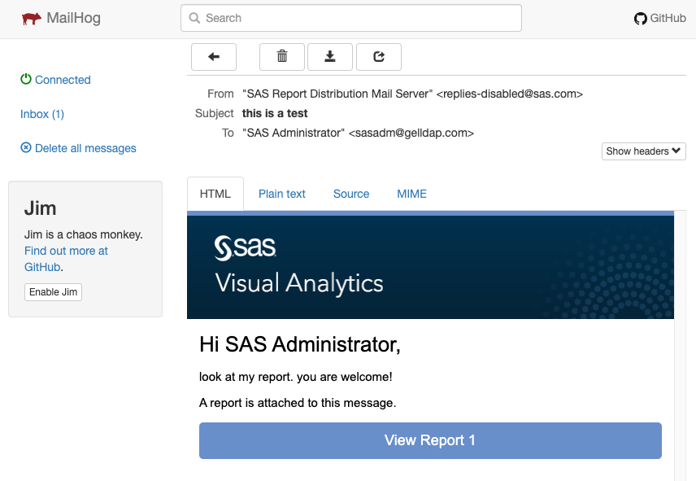

# GELmail

* [Intro](#intro)
* [What it looks like when it works](#what-it-looks-like-when-it-works)
* [test with Kubernetes](#test-with-kubernetes)
  * [If environment is already up:](#if-environment-is-already-up)
  * [adjust sitedefault.yaml if there is still time](#adjust-sitedefaultyaml-if-there-is-still-time)
* [run locally on docker (in case that helps)](#run-locally-on-docker-in-case-that-helps)
  * [Run docker container](#run-docker-container)
* [test from the shell](#test-from-the-shell)

## Intro

GELmail is a portable, self-contained SMTP server.

It is based on [MailHog](https://github.com/mailhog/MailHog).

It allows to quickly confirm Viya's ability to send e-mails.

It is not a replacement for a production-grade e-mail server.

## What it looks like when it works

This is what having received an e-mail from Viya looks like in GELmail:



## test with Kubernetes

```bash
#choose your NS:
NS=dev

# deploy
kubectl apply -n ${NS} -f https://gelgitlab.race.sas.com/GEL/utilities/gelldap/-/raw/master/bases/gelmail/deployment.yaml
kubectl apply -n ${NS} -f https://gelgitlab.race.sas.com/GEL/utilities/gelldap/-/raw/master/bases/gelmail/service.yaml

# wait for it to be running
kubectl -n ${NS} get pods -l app=gelmail-server

```

start a port-forward to see the web UI:

```bash
kubectl --namespace ${NS} port-forward --address 0.0.0.0  svc/gelmail-service 8025:8025

```

### If environment is already up:

go into EV and enter the info.

* server: `gelmail-service`
* port: `1025`

### adjust sitedefault.yaml if there is still time

add this to sitedefault.yaml

```yaml
#under block
#config:
#  application:
    sas.mail:
      host: 'gelmail-service'
      port: '1025'
      allowAllSenders: 'true'
      fromAddress: 'gelmail@gelmail.com'
      properties:
        mail.debug: 'true'
    management.health.mail:
      enabled: 'true'
```

## run locally on docker (in case that helps)

Only here because that's where I started

### Run docker container

```bash
docker container run \
    --rm  -d \
    --name mailhog  \
    -p 8025:8025 \
    -p 1025:1025 \
    mailhog/mailhog
```

## test from the shell

from <https://blog.mailtrap.io/mailhog-explained/>

install mhsendmail (like sendmail, but for mailhog)

```
wget https://github.com/mailhog/mhsendmail/releases/download/v0.2.0/mhsendmail_linux_amd64
sudo chmod +x mhsendmail_linux_amd64
sudo mv mhsendmail_linux_amd64 /usr/local/bin/mhsendmail
```

then test mailhog itself:

```
mhsendmail what@whatnow.com <<EOF
From: SAS Viya 4 <SAS_Viya_4@home.com>
To: Me Me <My_user@superSASme.com>
Subject: Test message

Hey!

Some content!

That's a plain e-mail, eh!

Bye

EOF
```

Then open the web app (hostname:8025)
