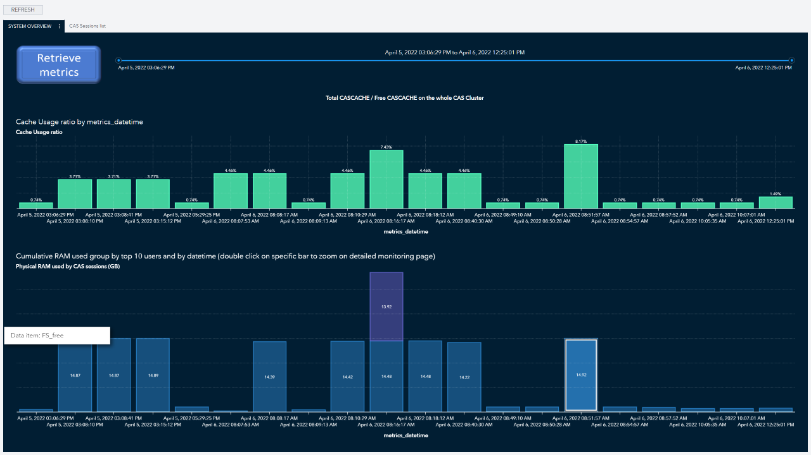
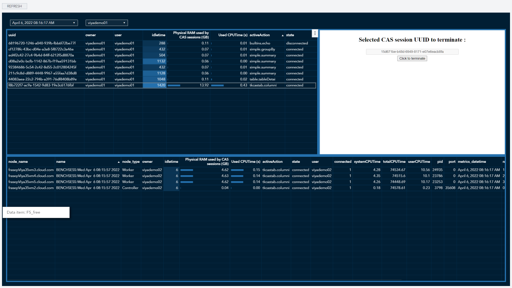

# CAS session and cache and RAM consumption monitoring simple Viya application
## This is developped as a demo and not supported directly by SAS but provided as a sample

This application is composed of 2 jobs and a VA report.
It is using REST API on CAS to get on-demand statistics, and also to terminate a selected cas session.

Find below the 2 pages of the report :

